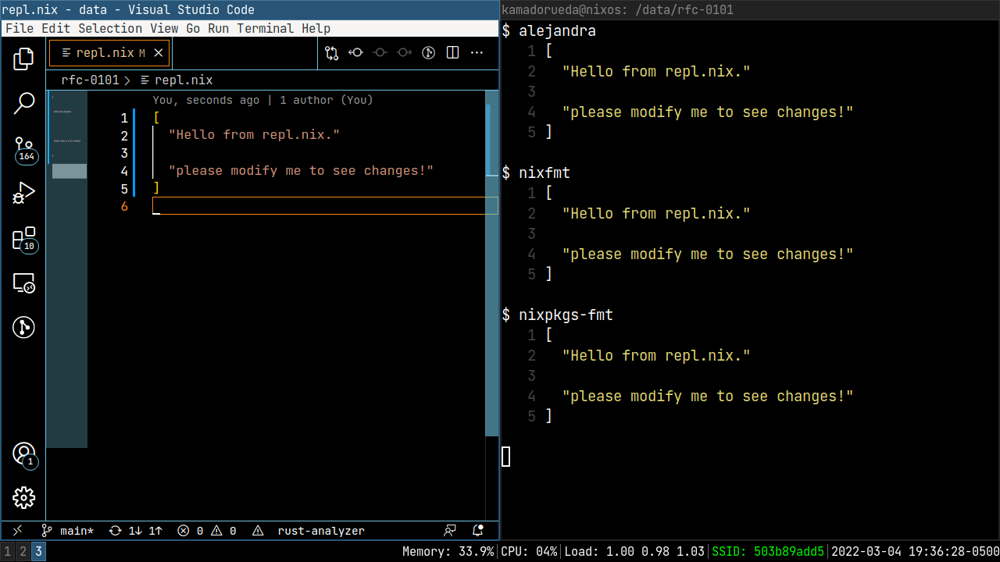

# [RFC 0101](https://github.com/NixOS/rfcs/pull/101)

## Goal

Decide on a recommended automated formatter for nix files in Nixpkgs.

## Why

Prevent debate around how things should be formatted. :facepalm:

## About

This repository hosts scripts and code
intended to measure the different aspects of formatting.

It is divided in the following sections:

- :heavy_check_mark: Idioms:

  Does readability of existing code improve after formatting?

- :space_invader: Monsters:

  Does readability of ugly code improve after formatting?

- :boxing_glove: Discussions:

  Possible points of disagreement on how we should format
  certain Nix expressions.

# How to contribute

Add a file called `before.nix` anywhere in this repository
and then run:

```sh
$ nix run .#format
```

Additionally:

- Open `repl.nix` in the editor of your choice.
- Run:
  ```sh
  $ nix run .#repl
  ```

This will show the output of formatting `repl.nix`
with all of the available formatters and syntax highlighting.

Every time you save `repl.nix`, it will reload automatically,
like this:


